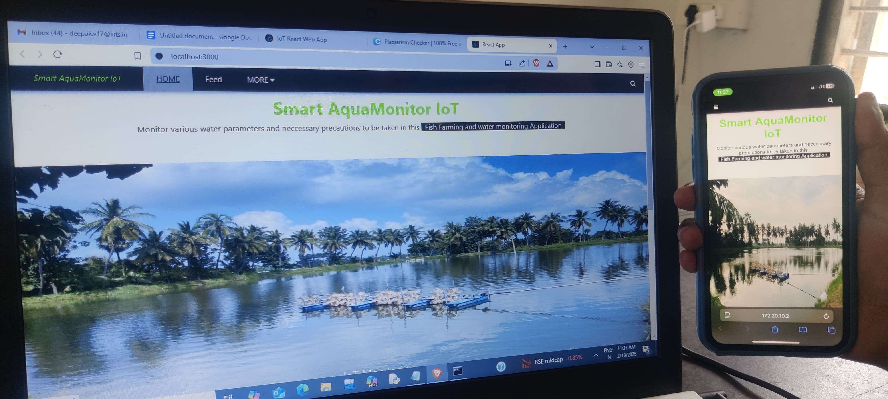
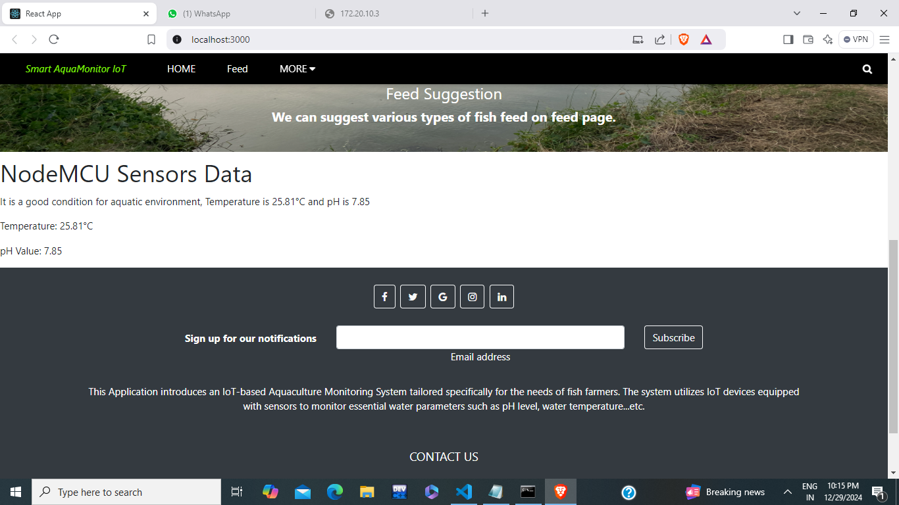
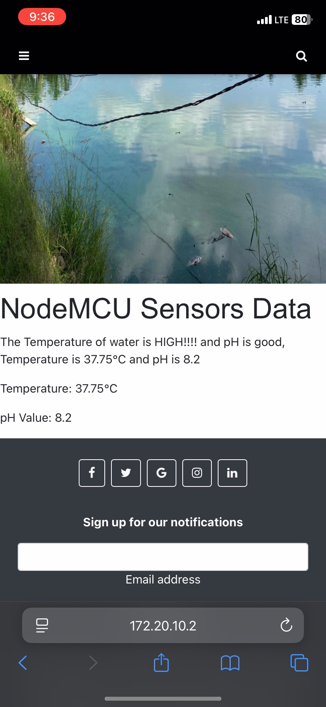

# IoT Based AquaMonitor

An IoT-based smart aquaculture monitoring system that helps monitor water quality parameters such as **temperature** and **pH levels** in real time. The project uses **Arduino/NodeMCU ESP8266**, sensors, and a **React web application** to display live sensor data and alerts.

---

## 🚀 Features

* Real-time temperature monitoring
* Real-time pH level monitoring
* IoT integration using NodeMCU ESP8266
* React frontend for live data visualization
* Express.js backend API
* Sensor status alerts and recommendations
* Responsive web interface
* Easy integration with additional sensors

---

## 🛠️ Tech Stack

### Frontend

* React.js
* React Router DOM
* CSS

### Backend

* Node.js
* Express.js

### Hardware / IoT

* NodeMCU ESP8266
* Arduino IDE
* pH Sensor
* Temperature Sensor

---


### Start React Frontend

```bash
npm start
```

Frontend runs on:

```bash
http://localhost:3000
```

---

## 🔌 Hardware Setup

### Components Required

* NodeMCU ESP8266
* pH Sensor
* Temperature Sensor
* Breadboard
* Jumper Wires
* USB Cable

### Workflow

1. Sensors collect water data.
2. NodeMCU processes sensor values.
3. Data is sent to the backend server.
4. React frontend fetches and displays live readings.
5. Alerts are shown when values exceed safe ranges.

---

## 📊 Sample Output





<p align="center">
  
</p>


<p align="center">
  
</p>


```text
Arduino Sensors Data
THE TEMPERATURE IS GOOD AND PH IS HIGH YOU NEED TO MONITOR THE PH !!!!!!
Temperature = 28°C
pH Value = 8.2
```

---

# 📁 Project Structure

```bash
IoT_Based_AquaMonitor/
│
├── frontend/          # React frontend
├── backend/           # Node.js + Express backend
├── arduino/           # NodeMCU ESP8266 code
├── README.md
└── package.json
